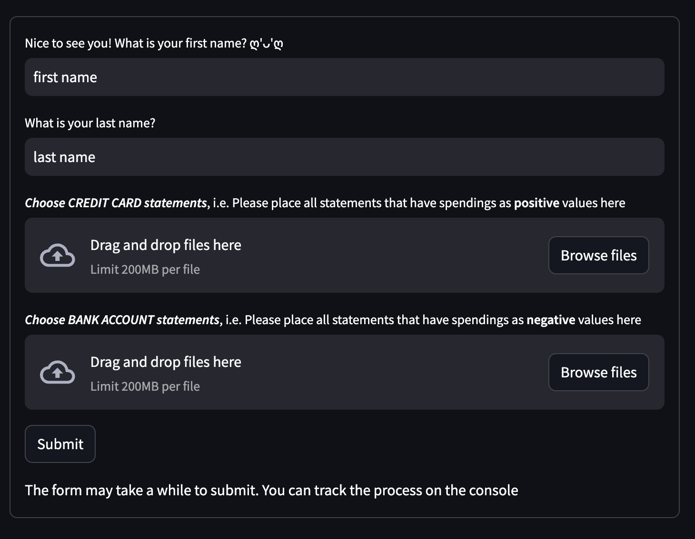
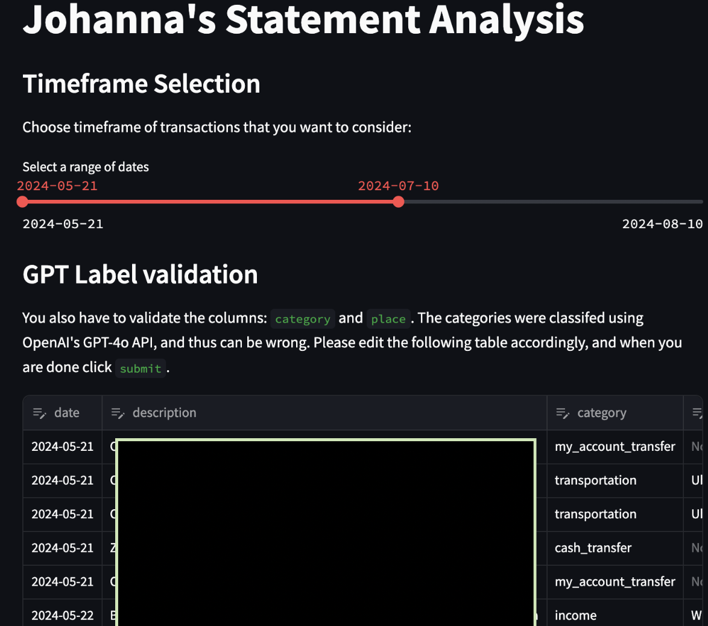
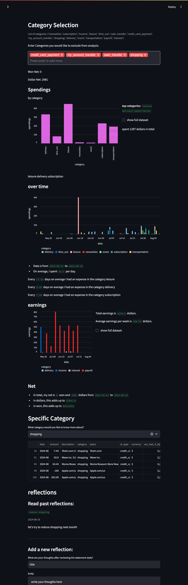

# bank-statement-insight
## Overview
bank-statement-insight is a tool designed to help you analyze bank statement PDFs, extract transaction data, and generate meaningful insights. This project automates the process of copying transactions into a database, creating visualizations, generating statistics, and writing comments to give you a better understanding of your financial habits.

## Limitations
- Tested only with Bank of America credit card / account statements, Chase credit card statements for now.
- Hard-coded `won ₩` exchange rate in `streamlit_helpers.py` and you will see the amount you spent in `won` on the analysis page. In the next update, you will be able to choose what currency you want to see the analysis in on a dropdown menu. (coming soon!)

## Usage
Upload your bank statement PDF via the Streamlit dashboard.
The app will parse the PDF and extract transaction data, storing it in the SQLite database.
View and interact with your transaction data using the tools provided by the app. Generate statistics and visualizations to analyze your spending patterns.

Everything (i.e. your data) stays local. (Although your browser will open, notice how in the url section you see `localhost`.) The app is not online, and openAI GPT API calls are only made for `transaction description category/place classification`.

## Installation
Clone the repository and cd into it.

Install the required packages:
```
pip install -r requirements.txt
```

***You will need a OpenAI GPT API KEY***. When you run the app (command below), it will prompt you for a GPT API Key and save it in the file `api_key` **ON THE CONSOLE** 

Run the app:
```
streamlit run landing_page.py
```

If you are having issues, please refer to the [troubleshooting section](##troubleshooting).


## Features
- **User Input Dashboard**:
    - Allow user to upload their name and bank statements on `landing_page`. 
- **GPT Label Editing and Timeframe Selection**:
    -  Utilizes the OpenAI API using GPT `gpt-4o-2024-08-06` model for ***labeled categories and places*** extracted from the transaction descriptions. Allows user to directly edit the gpt labels on the `edit data page`.
    - User can set custom transaction timeframes on the `edit data page`
- **Data Visualization and Commentary**: 
    - Users can select categories for data analysis on the `analysis page`. 
    - Users can add a quick comment on the page, and when the user opens the program again and enters the same first and last name, the comment will show up with the date at the end of the `analysis page`. 

\* The pages are linked via the `submit` button on each page.
\* If you would like to delete all user data, simply delete the `user_db.db` file.

## Libraries Used
- **SQLite3 & SQLAlchemy**: Store extracted data by user in a SQLite database using SQLAlchemy for robust relational database management.
- **Pandas**: For data manipulation.
- **Streamlit**: Utilize Streamlit for an interactive frontend, making it easy to upload files, view data, and explore statistics. Create graphs and visual representations of your financial data.
- **PdfReader**: To retrieve text by page from pdf.


## Project Structure
`landing_page.py`: The main entry point for the Streamlit app.
`models.py:` Contains the SQLAlchemy models for the database and Utility functions for PDF parsing, data manipulation, etc.
`user_db.db`: The SQLite database where all data is stored.
`requirements.txt`: A list of Python packages required to run the project.
### Example:




## Troubleshooting
Q: The streamlit page just says `running` without showing anything on the page.
A: It might take a while when it is your first time running the application.

Q: Nothing happens after I click submit.
A: Check the console where you ran `streamlit run landing_page.py`. 


## TO DO:
Let me know if you'd like any adjustments or additional information! This is my first project using a database so I have a lot to learn ღ'ᴗ'ღ

- test with other banks, especially bank statements in other currencies
- allow user to explicitly add category types before calling gpt

## License
This project is licensed under the MIT License. See the LICENSE file for details.
